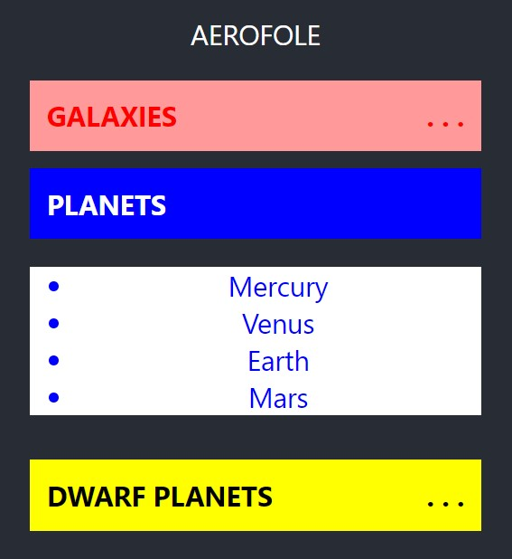

# Aerofole
A simple accordion component built with react  

npm i aerofole  
  
## use
<code>  
import Aerofole from 'aerofole';  

function App() {  
  return (  

    

        ...
        <Aerofole title="planets" background="blue" color= "white">
            <ul style={{ background: "white", color:"blue" }}>
                <li>Mercury</li>
                <li>Venus</li>
                <li>Earth</li>
                <li>Mars</li>
            </ul>
        </Aerofole>
        ...
    

  );
}
</code>

## Publish process
npm version patch
npm run build  
npm pack  
npm publish  

-------------    
   
Alex Alves  